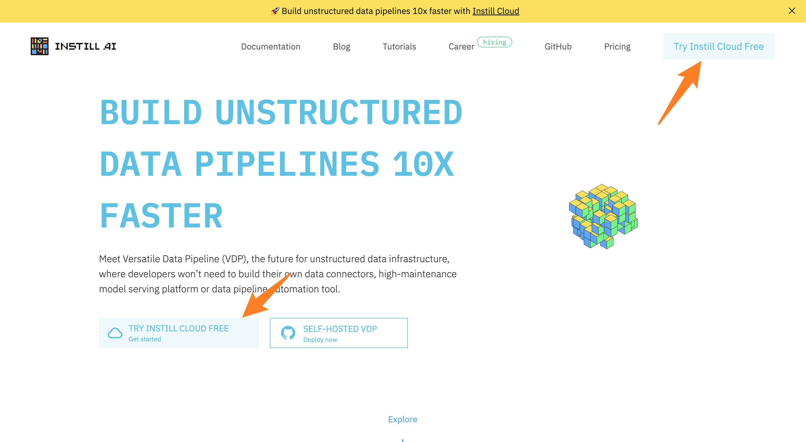
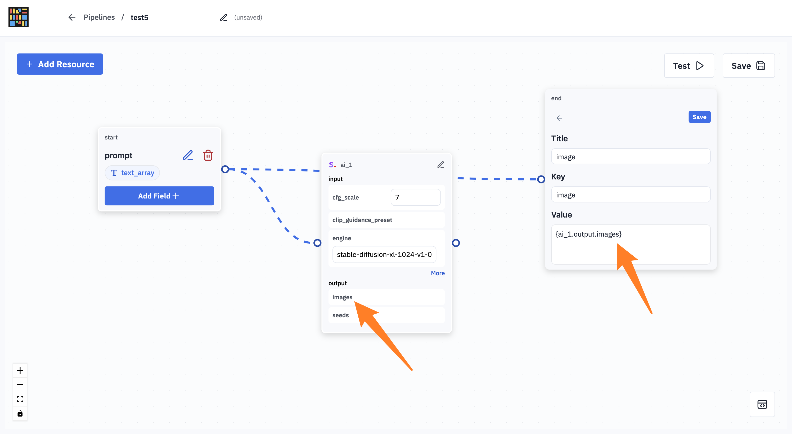
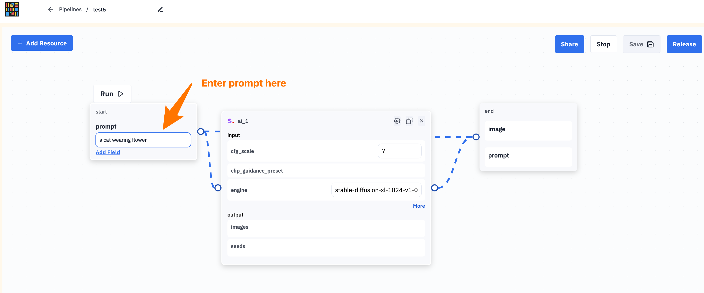

# Hacktoberfest 2023 Guide to Sharing Your Pipelines

Welcome to our tutorial on creating a pipeline using [Instill Cloud](https://console.instill.tech/) and earning credits to redeem some cool swag for the Hacktoberfest event. Let's get started with these simple steps!

## Step 1: Visit [Instill AI](https://www.instill.tech/)

Click on the `TRY INSTILL CLOUD FREE` button and create your account.

## Step 2: Create a Pipeline

Click `Add Pipeline` to begin your journey.

Next, click `Add AI Connector`

Choose your desired model. Here, we choose 'Stability AI'

Fill in the necessary information to activate the mode.

## Step 3: Setup the Pipeline

Edit the parameters in each node, and the nodes will automatically connect in the pipeline.

Nodes start unconnected.

Connected after adding a referencing field using curly braces `{}`.

Nodes are successfully connected.

## Step 4: Test the Pipeline

Press the `Test` button to save and test your pipeline.

Enter your prompt and click `Run`.

Get your pipeline triggering result.

## Step 5: Share on Social Media

To win Instill Stickers by participating in Hacktoberfest, please share your pipeline on any social media platform.

## Step 6: Submit on Google Form

To claim your credits, make sure to submit your work via [Google form](https://forms.gle/2r91a7ChMLVnWLm37). Don't forget to submit multiple times for each task you complete.

Congratulations! You've successfully created a pipeline using Instill Cloud and earned credits to redeem some swag for the Instill AI x Hacktoberfest 2023 event.

For any questions or more information, please refer to these useful resources:
- [Instill AI x Hacktoberfest Orientation](https://youtu.be/xmWHOYjfmkg): : A brief introduction to Instill AI's product, what to expect, and how to participate in Hacktoberfest.
- [Documentation](https://www.instill.tech/docs): Get acquainted with our product and explore its capabilities.
- [Community Repository](https://github.com/instill-ai/community/issues?q=is:issue+is:open+label:hacktoberfest,+label:%22good+first+issue%22,%22help+wanted%22+): Discover existing issues and explore our ongoing projects.
- [Hacktoberfest Submission Form](https://forms.gle/2r91a7ChMLVnWLm37): Once you've completed your work, submit the form to claim your credits.
- [Discord Community](https://discord.gg/sevxWsqpGh): If you have any questions or need further information regarding Hacktoberfest or Instill AI, please visit our Discord.
- [Hacktoberfest Official Website](https://hacktoberfest.com/): To receive a Digital Reward Kit from Hacktoberfest or have a tree planted in your name through Tree Nation, register for a Hacktoberfest account between September 26th and October 31st and follow the rules on the Hacktoberfest website.